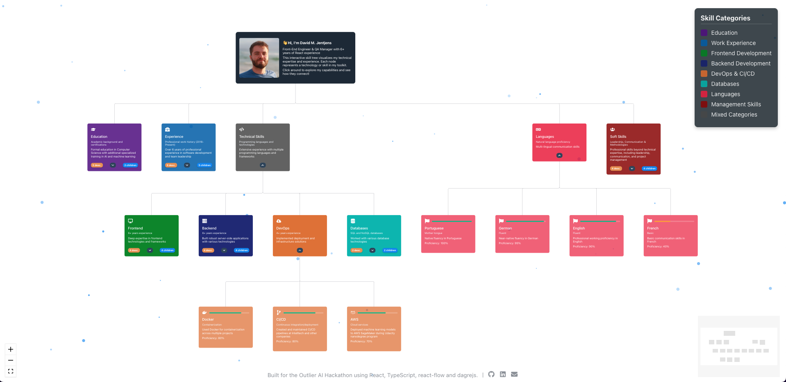

# 🌳 Skill Tree Visualizer

<div align="center">

[](https://skill-tree-portfolio-7wgp.vercel.app/)
[](https://opensource.org/licenses/MIT)
[](https://www.typescriptlang.org/)
[](https://reactjs.org/)

An interactive, expandable skill tree visualization built for the **Outlier AI Hackathon**. This project offers an elegant way to showcase professional skills and experience in an engaging node-based visualization.

</div>

## 🚀 Live Demo

Check out the live demo: [Skill Tree Visualizer](https://davidjentjens.github.io/skill-tree-visualizer)

## ✨ Screenshots

<div align="center">
  
</div>

<div align="center">
  
</div>

## 🧠 About The Project

This project was created specifically for the **Outlier AI Hackathon** as a creative way to visualize professional skills and experience. It reimplements and extends the expand/collapse functionality from ReactFlow's examples.

### Key Features

- **Interactive Visualization**: Click on nodes to expand and collapse skill branches
- **Dynamic Layout**: Automatic node positioning using the dagre algorithm
- **Responsive Design**: Works across different screen sizes
- **Performance Optimized**: Using MobX for efficient state management
- **Beautiful UI**: Smooth animations and a particle background for visual appeal
- **Type-Safe**: Built with TypeScript for robust code quality

## 🛠️ Technology Stack

- **React** - UI framework
- **TypeScript** - Type safety
- **ReactFlow** - Framework for interactive node-based UIs
- **dagre.js** - Graph layout algorithms
- **MobX** - State management
- **Stitches** - Styling solution
- **Vite** - Build tool and development server

## 🚀 Getting Started

### Prerequisites

- Node.js (v14 or higher)
- Yarn or npm

### Installation

1. Clone the repository

```sh
git clone https://github.com/davidjentjens/skill-tree-visualizer.git
cd skill-tree-visualizer
```

2. Install dependencies

```sh
yarn install
```

# or

```sh
npm install
```

Start the development server

```sh
yarn dev
```

# or

```sh
npm run dev
```

Open your browser and navigate to <http://localhost:5173>

🧪 Building for Production

```sh
yarn build
```

# or

```sh
npm run build
```

🔧 Customization
To customize the skill tree with your own data, modify the tree structure in src/data/tree.ts.
<br/><br/>
🎭 Outlier AI Hackathon
This project was specifically created for the Outlier AI Hackathon, showcasing how interactive visualizations can transform the way we present professional information. The hackathon challenged participants to create innovative applications, and this skill tree visualization represents a unique approach to professional portfolios.
<br/><br/>
📝 License
Distributed under the MIT License. See LICENSE for more information.
<br/><br/>
👤 Contact
David M. Jentjens - <davidjentjens@gmail.com>
Project Link: <https://github.com/davidjentjens/skill-tree-visualizer>
<br/><br/>

<div align="center">
  <sub>Built with ❤️ for the Outlier AI Hackathon</sub>
</div>
